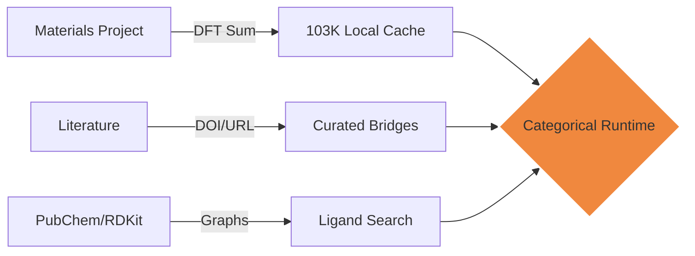

# The Multi-Scale Data Foundation
## Grounding Logic in Physical Reality

### Voiceover Script

"None of this math works without a massive, grounded foundation of physical data. KOMPOSOS-IV operates across three distinct scales of reality.

At the **Atomic Scale**, we parse SMILES strings and heavy atom counts to ensure ligands are physically realizable.
At the **Structural Scale**, we leverage a unified cache of 103,671 Materials Project structures, deriving space groups and lattice parameters with DFT-grade precision. 
And at the **System Scale**, we use our curated domain bridges to reason about how these structures interact in a 3D battery cell or a clinical treatment. 

We aren't just mapping data; we are mapping the **Relations** between scales—from the bond of an atom to the failure of a device."

---

### Visual Asset: Multi-Scale Reasoning (Inline SVG)

<svg width="600" height="320" viewBox="0 0 600 320" fill="none" xmlns="http://www.w3.org/2000/svg">
  <!-- Scale 1: Atomic -->
  <rect x="50" y="240" width="500" height="60" rx="5" fill="#161b22" stroke="#30363d" />
  <text x="65" y="275" fill="#8b949e" font-size="12" font-weight="bold">ATOMIC (SMILES / CAS / ATOMS)</text>
  
  <!-- Scale 2: Crystal -->
  <rect x="50" y="140" width="500" height="80" rx="5" fill="#161b22" stroke="#58a6ff" stroke-width="2" />
  <text x="65" y="175" fill="#58a6ff" font-size="14" font-weight="bold">CRYSTAL (103K+ MP STRUCTURES)</text>
  <text x="65" y="200" fill="#c9d1d9" font-size="10">Lattice: a, b, c, α, β, γ | Ef | Space Group</text>
  
  <!-- Scale 3: System -->
  <rect x="50" y="20" width="500" height="100" rx="5" fill="#161b22" stroke="#f0883e" stroke-width="2" />
  <text x="65" y="55" fill="#f0883e" font-size="16" font-weight="bold">SYSTEM (DEVICE / CLINICAL)</text>
  <text x="65" y="85" fill="#c9d1d9" font-size="12">Cell Stack | Compliance | Clinical Outcome</text>

  <!-- Relationships -->
  <path d="M 300 240 V 220" stroke="#f0883e" stroke-width="2" marker-end="url(#arrow)" />
  <path d="M 300 140 V 120" stroke="#f0883e" stroke-width="2" marker-end="url(#arrow)" />
  
  <defs>
    <marker id="arrow" viewBox="0 0 10 10" refX="5" refY="5" markerWidth="4" markerHeight="4" orient="auto">
      <path d="M 0 0 L 10 5 L 0 10 z" fill="#f0883e" />
    </marker>
  </defs>
</svg>

---

### Data Provenance Chain (Mermaid)

